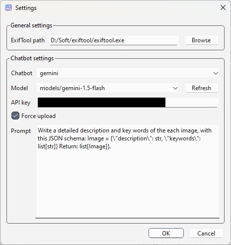
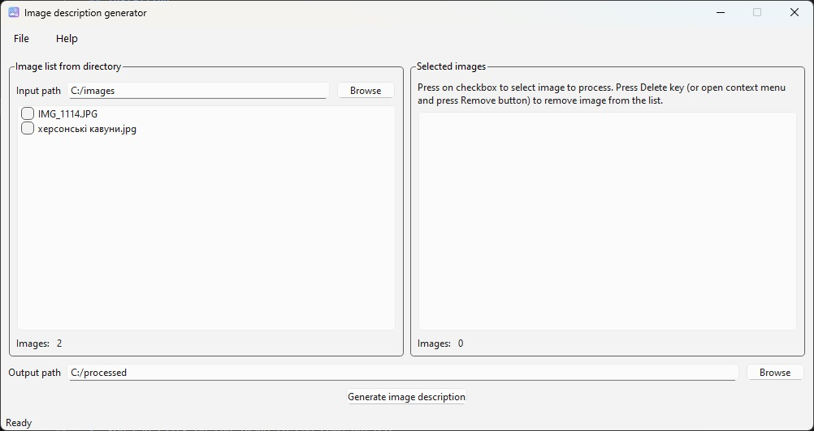
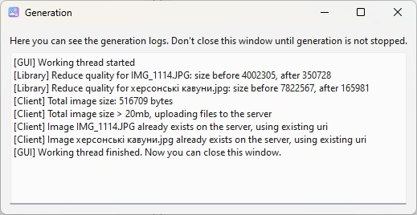

# Image description generator GUI


This is a GUI application that uses [imgdescgen](https://github.com/JusicP/imgdescgen) library to generate image description and write it to image metadata, and [PySide6](https://pypi.org/project/PySide6/) for GUI.

## Installing
After repo cloning, do this:
1. Run this from source:
```
pip install -r requirements.txt
```
2. Install [ExifTool by Phil Harvey](https://exiftool.org/) (minimum 12.15 version).

## How to use
### Setting up the program
Before starting using program, you need to configure it. Go to `File` -> `Settings`.
You will see following dialog window:



Then do the following steps:

1. Setup path to the ExifTool executable or leave field empty if path is in PATH environment variable.
2. Choose what chatbot will be used (choice limited to Gemini).
3. Enter Gemini API key. [How to get it](https://ai.google.dev/gemini-api/docs/api-key)
4. Choose model to use. To get list of available models, click on `Refresh` button.
5. Click on OK button.

The configuration file is saved in the current working directory and is called `config.json`.

### Image description generating 
1. Select the input directory with images by clicking `Browse` button on the left side of the main window*.
2. Check images you want to process, checked images will appear on the right list.
4. You select other input directory and check other images. Checked images are saved in `config.json`
5. You can click on the image to see some details.
6. Select the output directory by clicking `Browse` button next to the output path text box**.
7. Click on `Generate` button.



If everything is ok, you will hear corresponding sound and a message in the log, notifying you that everything is done.



**Notes**:

*Input images must have `*.jpg` extension;

**Output directory must be empty;